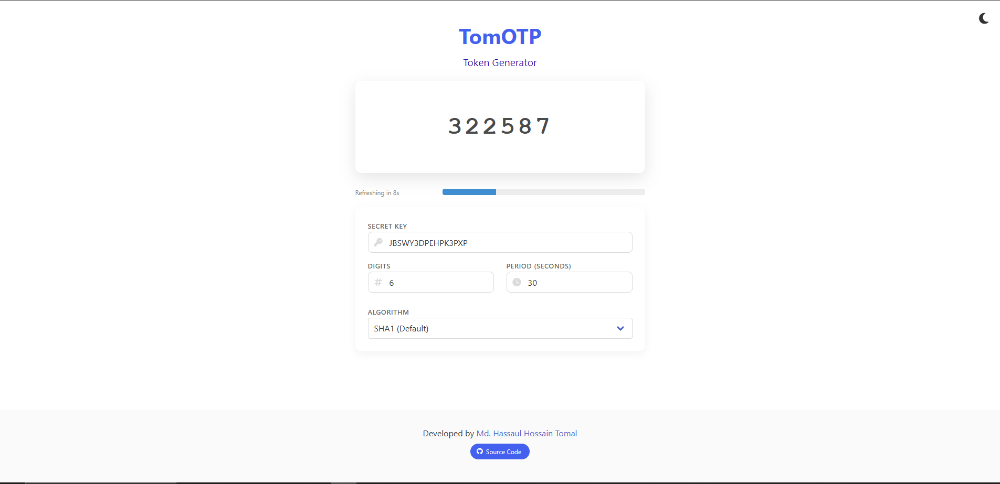

# TomOTP: Quantum Token Generator ⚛️

[](https://opensource.org/licenses/MIT)
[](https://vuejs.org/)
[](https://bulma.io/)
[](https://web.dev/progressive-web-apps/)
[](https://en.wikipedia.org/wiki/Client-side)
[](https://developer.mozilla.org/en-US/docs/Web/Progressive_web_apps)
[](https://opensource.org/)

> A secure, client-side, and highly customizable One-Time Password (OTP) generator that keeps your 2FA tokens local and private.

## 🌟 Featured On

[](https://github.com/hasanulhossaint/tomotp/stargazers)
[](https://github.com/hasanulhossaint/tomotp/network/members)

## 📸 Screenshot


*Clean and modern OTP generator interface showing active tokens with progress bars, copy buttons, and settings options*

## 🚀 Features

| Feature | Description |
|---------|-------------|
| 🔒 **Military-Grade Security** | Your secrets never leave your device. All cryptographic operations happen client-side using battle-tested `otpauth.js` |
| 🎨 **Sleek Modern UI** | Beautiful minimalist design with smooth animations, real-time progress bars, and intuitive one-click copy functionality |
| 📱 **Progressive Web App** | Install as a native app on any device. Works completely offline after first load |
| ⚙️ **Advanced Customization** | Support for SHA1, SHA256, SHA512 algorithms. Customizable token digits (6-8) and period (15-60 seconds) |
| 🌐 **Cross-Platform** | Runs on desktop, mobile, tablet. Compatible with all major browsers |
| 🔍 **Open Source** | Transparent codebase. Community audited and continuously improved |

## 📊 Technology Stack

**Frontend Framework**


**Styling & UI**


**Core Libraries**


**Build & Deployment**


## 🏁 Quick Start

### Prerequisites
- Modern web browser (Chrome 80+, Firefox 75+, Safari 13+, Edge 80+)
- No installation or server required!

### Local Development

1. **Clone the repository**
   ```bash
   git clone https://github.com/hasanulhossaint/tomotp.git
   cd tomotp
2. **Run locally (choose one method)**
    ```bash
    Method 1: Simple file open
open index.html
Method 2: Local server (recommended)
python -m http.server 8000
or
npx serve .


3. ***Start developing!***
    ```bash
    The app will be available at http://localhost:8000
All changes are hot-reloaded automatically    

### Browser Support

| Browser | Version | Status |
|---------|---------|--------|
| Chrome | 80+ | ✅ Fully Supported |
| Firefox | 75+ | ✅ Fully Supported |
| Safari | 13+ | ✅ Fully Supported |
| Edge | 80+ | ✅ Fully Supported |
| Opera | 67+ | ✅ Fully Supported |

## 🛠️ Development Guide

### Key Components

- **OTP Generator**: Core token generation using otpauth.js
- **Progress Bar**: Real-time visual countdown timer
- **Clipboard Manager**: One-click copy functionality
- **Settings Modal**: Customizable algorithm and token options
- **PWA Handler**: Offline capability and app installation
## 🤝 Contributing

We love contributions! Here's how you can help:

### Contribution Workflow

1. 🍴 Fork the repository
2. 🌿 Create a feature branch: `git checkout -b feature/amazing-feature`
3. 💻 Make your changes
4. ✅ Test your changes thoroughly
5. 📝 Commit your changes: `git commit -m 'Add amazing feature'`
6. 📤 Push to the branch: `git push origin feature/amazing-feature`
7. 🔀 Open a Pull Request

### Development Standards

- **Code Style**: Follow Vue.js style guide and ESLint rules
- **Testing**: Test all changes across multiple browsers
- **Documentation**: Update README and comments as needed
- **Commit Messages**: Use conventional commit format

### Need Help?

- 📖 Check existing [issues](https://github.com/hasanulhossaint/tomotp/issues)
- 💬 Join our [discussions](https://github.com/hasanulhossaint/tomotp/discussions)
- 🐛 Report bugs via [GitHub Issues](https://github.com/hasanulhossaint/tomotp/issues/new)

## 📊 Performance Metrics

| Metric | Value |
|--------|-------|
| Initial Load Size | < 100KB |
| Time to Interactive | < 1s |
| Lighthouse Score | 100/100 |
| Core Web Vitals | All Passing |

## 🔒 Security

- **Zero Data Collection**: No analytics, no tracking, no telemetry
- **Client-Side Only**: No server communication required
- **Regular Audits**: Continuous security reviews and updates
- **Transparent Code**: Fully open source for community verification

## 📄 License

This project is licensed under the MIT License - see the [LICENSE](LICENSE) file for details.

[](https://opensource.org/licenses/MIT)

## ❤️ Credits & Acknowledgments

**Created by** Md. Hassaul Hossain Tomal

**Special thanks to:**
- [otpauth.js](https://github.com/hectorm/otpauth) team for the robust OTP library
- [Vue.js](https://vuejs.org/) team for the amazing framework
- [Bulma CSS](https://bulma.io/) for the beautiful styling framework
- All our amazing [contributors](https://github.com/hasanulhossaint/tomotp/graphs/contributors)

## 🌟 Show Your Support

Give a ⭐️ if this project helped you!

[](https://github.com/hasanulhossaint/tomotp/stargazers)
